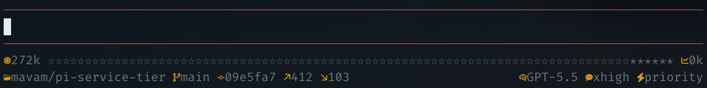

# ⚡ pi-service-tier

A [pi](https://github.com/badlogic/pi-mono/tree/main/packages/coding-agent)
extension that applies provider service tiers.

## 📦 Install

```bash
pi install npm:pi-service-tier
```

If you use [pi-fancy-footer](https://github.com/mavam/pi-fancy-footer), you'll
get a service tier widget in the footer:



## ✨ What it does

- Adds service tier parameters to supported provider requests when a tier is
  configured
- Adds `/fast` to toggle the current model provider between fast mode and off
- Adds `/service-tier` to configure all supported providers from an interactive
  modal
- Adds an optional service tier widget when `pi-fancy-footer` is installed

## 🚀 Commands

- `/fast`: toggles the current model provider between its fast tier and off. The
  supported providers all use `priority` as the fast tier.

- `/service-tier`: opens an interactive editor. The current model provider
  appears first, followed by the remaining supported providers. Press Enter or
  Space to cycle through `off` and the provider-specific tiers.

## ⚙️ Configure

Run `/service-tier` or create `~/.pi/agent/service-tier.json`:

```json
{
  "openai": "priority",
  "openai-codex": "flex",
  "anthropic": "priority",
  "google": "priority",
  "google-vertex": "flex"
}
```

### Supported providers

| Provider        | Tiers                  | Fast tier  |
| --------------- | ---------------------- | ---------- |
| `openai`        | `flex`, `priority`     | `priority` |
| `openai-codex`  | `flex`, `priority`     | `priority` |
| `anthropic`     | `priority`, `standard` | `priority` |
| `google`        | `flex`, `priority`     | `priority` |
| `google-vertex` | `flex`, `priority`     | `priority` |

To turn a provider off, omit its key. Only the values listed above are accepted.
Batch APIs are separate asynchronous APIs and are not configured by this
extension.

## 🧩 Footer widget

When [pi-fancy-footer](https://github.com/mavam/pi-fancy-footer) is installed,
the widget appears only when the active model uses a supported provider/API pair
and that provider has a configured tier.

The widget id is `pi-service-tier.service-tier`.

## 📝 TODO

- Account for service-tier pricing in pi usage metrics. The extension currently
  injects the tier into the provider request payload, but pi's OpenAI Codex cost
  calculation reads the requested tier from provider options. Until pi exposes a
  first-class extension path for that option, displayed usage costs can omit
  flex or priority multipliers.

## 📄 License

[MIT](LICENSE)
